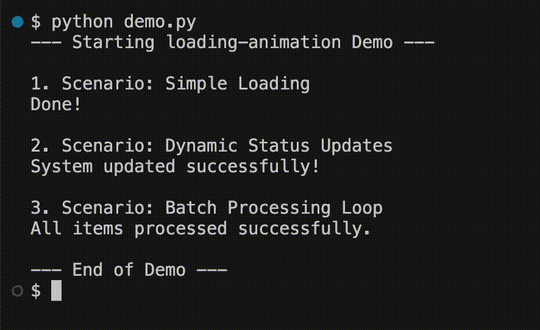

# Dynamic CLI Loading Animation
A lightweight, thread-based loading animation for Python.

 
## Installation

```bash
# Clone the repository
git clone https://github.com/enzoustk/python-loading-animation.git
cd python-loading-animation

# Install in editable mode
pip install -e .
```

## Quick Start

```python
import time
from loading_animation import loading_animation

# Basic usage
with loading_animation("Processing data"):
    time.sleep(2)

# Dynamic message updates
with loading_animation("Preparing...") as status:
    time.sleep(1.5)
    status['message'] = "Downloading data"
    time.sleep(2)
```

## Running the Demo

```bash
pip install -e .
python examples/demo.py
```

## 🛠️ How It Works

1. **Threading:** When the context manager starts, it spawns a daemon thread that handles the visual loop (`.`, `..`, `...`).
2. **Shared State:** It yields a dictionary (`status_data`). Since dictionaries are mutable, any changes you make to `status['message']` inside the `with` block are immediately visible to the animation thread.
3. **Terminal Control:** It uses the carriage return character (`\r`) to overwrite the current line and calculates padding to ensure that shorter messages cleanly overwrite longer ones.

## 📋 Requirements

* Python 3.6+
